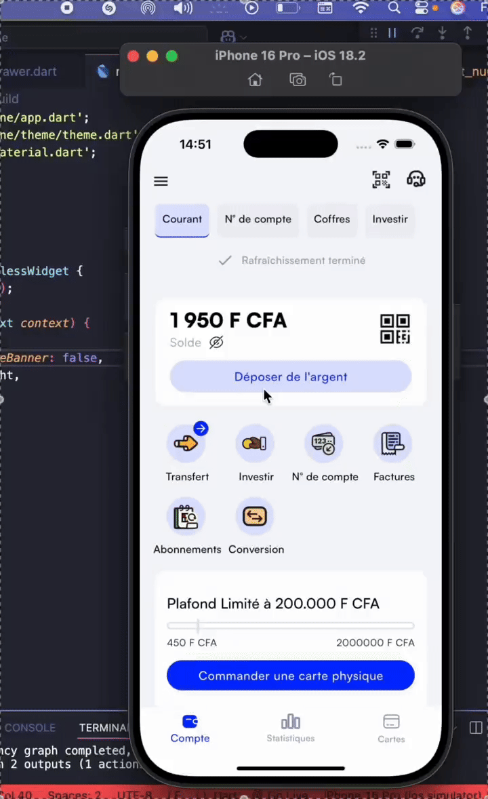
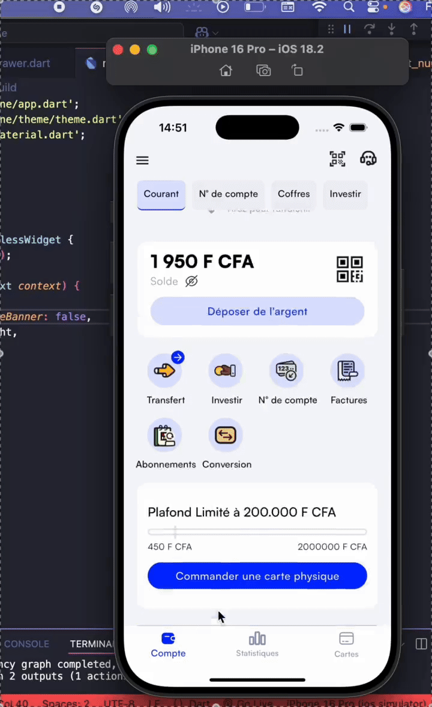
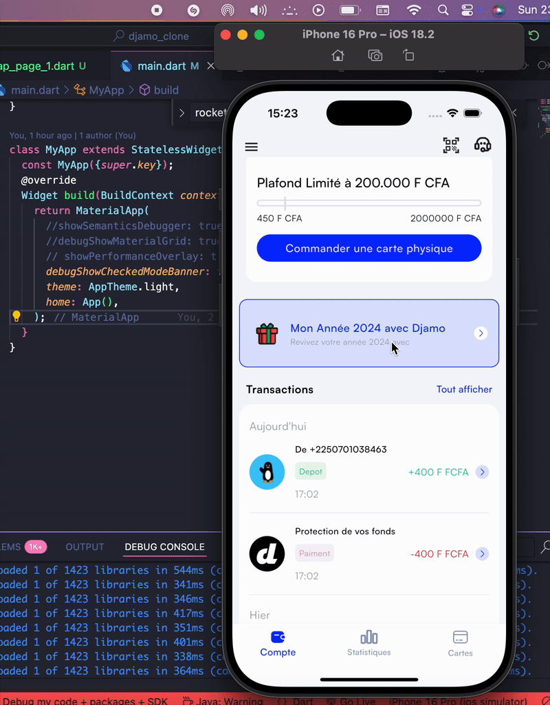

# 💳 Flutter UI Clone – Djamo App Screens

Hi there 👋🏾

This project is a **Flutter UI clone** of several screens from the Djamo mobile application.  
The goal was to reproduce the visual identity and layout with precision, using only Flutter widgets — no external UI libraries.

> 🙏 Special thanks to designer **Papa Mandaw DIOP** for the beautiful icons and illustrations that helped bring this clone to life.

---

## 🎥 Demo 1 – Home

## 🎥 Demo 2 – ...

## 🎥 Demo 3 – Recap

---

## 🚀 Highlights

- ✨ High-fidelity UI replication in Flutter  
- 🎨 Custom theming and consistent design system  

---

## 🧱 Tech Stack

- Flutter 
- Dart
- Custom widgets only (`Container`, `Stack`, `Positioned`, `Text`, `GestureDetector`, etc.)

